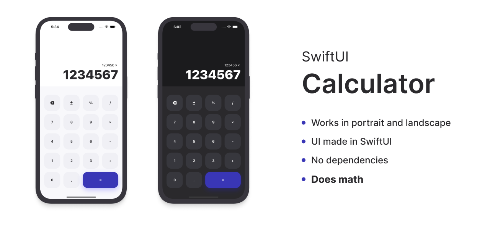

# SwiftUI Calculator

This is a calculator app, written in Swift and SwiftUI. This app is meant for me to practice and learn about Swift and SwiftUI. If it helps you to do the same, I am glad I could help!

## Main features

- App written in Swift and SwiftUI
- Works in portrait and landscape orientations
- Behaves exactly how I would like my calculator to behave
- Supports light and dark mode
- Doesn't require any dependencies
- **Does math** *(most of the times)*

## Disclaimer
This calculator app is only for entertainment and educational purposes. Do not use this calculator to calculate anything important, or rather don't use this calculator to calculate anything at all. Always use more stable and reliable alternatives.

## Credits
- Device mockups in this Readme are from [Flat iPhone Mockup 14/13/12/11/X/SE/8/7/6](https://www.figma.com/community/file/882254519102673494) by Richard Horvath, licensed under [CC BY 4.0](https://creativecommons.org/licenses/by/4.0/)
